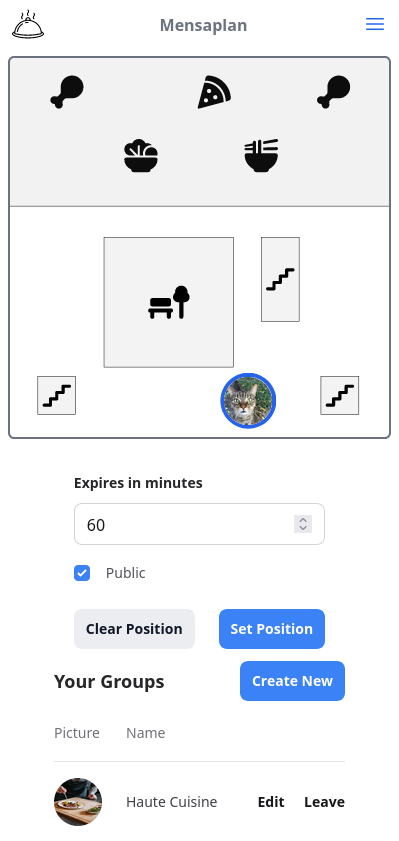
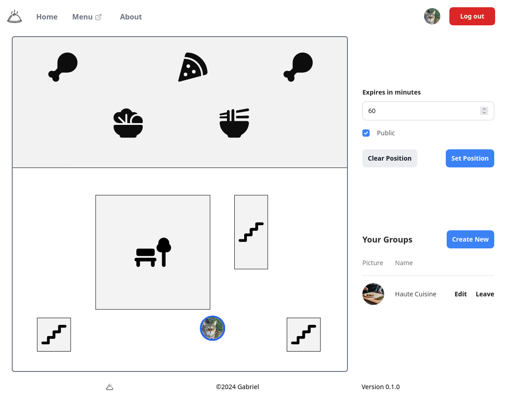

# Mensaplan

Garching's hottest new tool to find friends while eating.

## Features

* Cool and responsive web interface
* Current mensa menu with food ratings
* Private groups for friend groups, clubs, ...
* API for (Discord) Bots like [WoBot](https://github.com/Friendly-Banana/wobot).

## Techstack

* Elixir and Phoenix for the backend
* HEEx (HTML + Embedded Elixir) and TailwindCSS for the frontend

## Developing

### Running

* Run `mix setup` to install and setup dependencies
* Start the Phoenix server with `mix phx.server` or inside IEx with `iex -S mix phx.server`

Now you can visit [`localhost:4000`](http://localhost:4000) from your browser.

### Authentication

Authentication is done via Discord, so you'll need to

* Setup an [Application](https://discord.com/developers/applications)
* Add `http://localhost:4000/auth/discord/callback` to the _OAuth2_ -> _Redirects_.
* Save the  _Client ID_ and _Client Secret_, you need to pass them as environment variables.
  For example put them into a `.env` file and then run `export $(cat .env | xargs)`.

You can also use [uberauth](https://github.com/ueberauth/ueberauth/wiki/List-of-Strategies) directly with your favorite
OpenID provider, add the strategy to `mix.exs`, configure it in `config.exs` and replace the sign-in link.

User ids < 10 are reserved, these ids can only be assigned via direct DB access. User 1 is considered admin and can access special pages like the Dashboard.

### API

The API uses the environment variable `API_TOKEN` to authorize requests, they need to include it as a [bearer token](https://swagger.io/docs/specification/authentication/bearer-authentication/).

## Deploying

Wherever you want, requirements: can run Elixir and has a database.

Don't forget to set the environment variables.

I use [Gigalixir](https://www.gigalixir.com/docs/getting-started-guide/).
New versions are deployed with `git push gigalixir main`.
