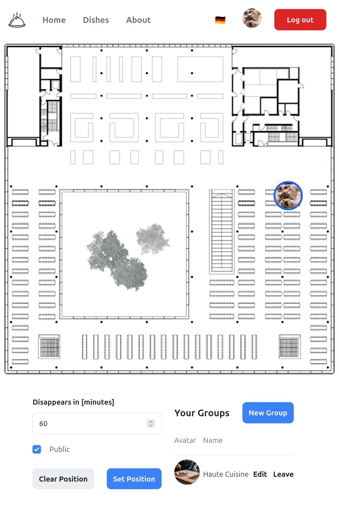
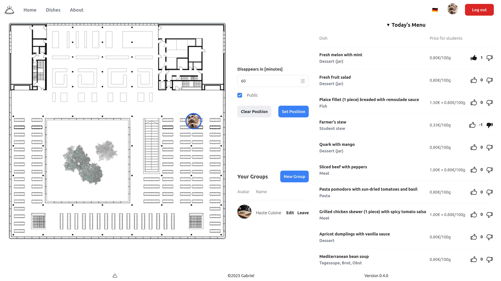

# Mensaplan

Garching's hottest new tool to find friends while eating.

## Features

* Cool and responsive web interface
* Private groups for friend groups, clubs, ...
* API for (Discord) Bots like [WoBot](https://github.com/Friendly-Banana/wobot).

## Techstack

* Elixir and Phoenix for the backend
* HEEx (HTML + Embedded Elixir) and TailwindCSS for the frontend

## Developing

Authentication is currently done via Auth0, so you'll need to set up a _Regular Web App_.

* Add `http://localhost:4000/auth/auth0/callback` to the _Allowed Callback URLs_.
* Copy the _Domain_, _Client ID_ and _Client Secret_, you need to pass them as environment variables.
  For example put them into a `.env` file and then run `export $(cat .env | xargs)`.

You can also use [uberauth](https://github.com/ueberauth/ueberauth/wiki/List-of-Strategies) directly with your favorite
OpenID provider, add the strategy to `mix.exs`, configure it in `config.exs` and replace the sign-in link.

* Run `mix setup` to install and setup dependencies
* Start the Phoenix server with `mix phx.server` or inside IEx with `iex -S mix phx.server`

Now you can visit [`localhost:4000`](http://localhost:4000) from your browser.

## Deploying

Wherever you want, only requirements: can run Elixir and has a database.

I use [Gigalixir](https://www.gigalixir.com/docs/getting-started-guide/).
Don't forget to set the environment variables there as well.
New versions are deployed with `git push gigalixir main`.